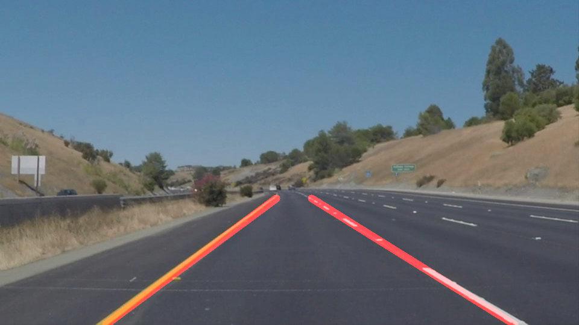
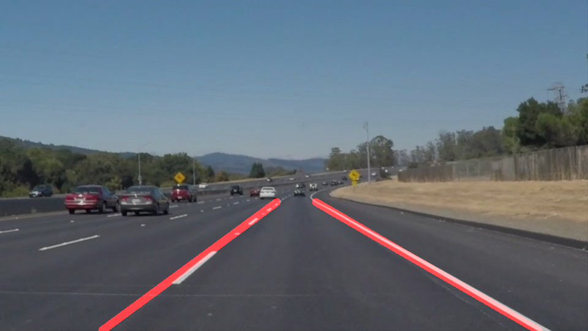
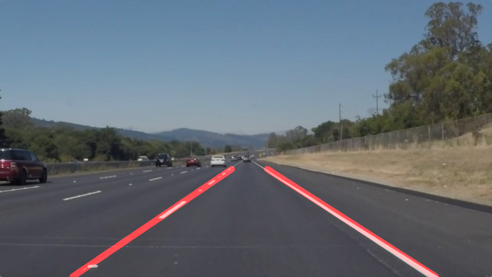
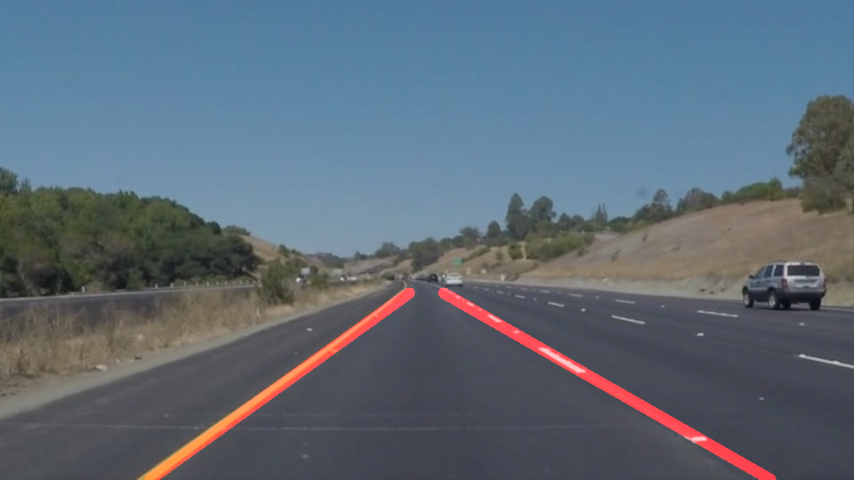
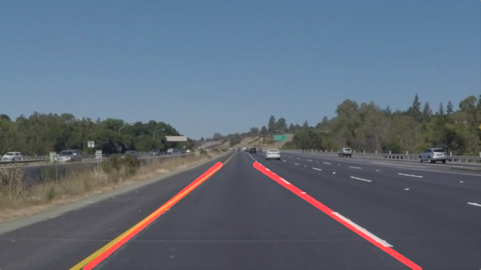

# Finding lane lines on the road
### [Udacity](https://www.udacity.com/) Program: Autonomous Vehicle Engineer, Project 1

[](http://www.udacity.com/drive)

> Example of inference:

<p align="center">
  
</p>

## Overview

This tool detects lane lines in images using Python and [OpenCV (Open-Source Computer Vision)](https://pypi.org/project/opencv-python/). OpenCV is a package that has many useful tools for analyzing images.  

Main files in the repository:

* `Proj-1-LaneLines.ipynb`: Jupyter notebook including main code to (1) import images/videos, (2) detect the lane lines, and (3) draw the detected lines back onto the images/videos. 
* `~test_images_output/`: Folder of output of the tool after processing images in `~test_images/`.
* `~test_videos_output/`: Folder of output of the tool after processing videos in `~test_videos/`.


## Motivation

When we drive, we use visual information to sense where we are and to decide where to go. The lines on the road show us where the lanes are, so we use them as our constant reference for where to steer the vehicle. 

In the process of developing an autonomous vehicle that works with existing roads, one of the first goals we would like to achieve is to automatically detect lane lines using computer vision.
 

## Usage Example

The Jupyter Project highly recommends new users to install [Anaconda](https://www.anaconda.com/distribution/); since it conveniently installs Python, the Jupyter Notebook, and other commonly used packages for scientific computing and data science.

Use the following installation steps:

1. Download Anaconda.

2. Install the version of Anaconda which you downloaded, following the instructions on the download page.

3. To run the notebook:

```
jupyter notebook Proj-1-LaneLines.ipynb
```

## Software Dependencies

Running this tool locally may be challenging given that the necessary image processing packages may be missing. A straightforward way to overcome this problem is to use [Udacity's Anaconda environment](doc/configure_via_anaconda.md), which was specifically built to provide unified software dependency support for projects like this one.


## Pipeline Description

The pipeline consists of 8 steps (not including the code needed to import image files), as follows:

1. Get image size and two-dimensional grid range, and assign values to variables.

2. Grayscale the image — calling helper function `grayscale()` — and apply Gaussian smoothing — calling helper function `gaussian_blur()`.

3. Apply Canny transform — calling helper function `canny()` — to get raw edges in the image. After some trial and error, I decide to use thresholds of `low=35` and `high=70`.

4. Create masked image of edges — calling helper function `region_of_interest()`. I define the vertices as percentages of the range of the image grid. Example: `(0.90*x_max, y_max)`.

5. Apply Hough transform to masked edges. Instead of calling the provided helper function `hough_lines()`, I call `cv2.HoughLinesP()` in order to get array of all Hough lines. I use the following parameters:
	* `rho = 1`
	* `theta = 1*np.pi/180`
	* `threshold = 4`
	* `min_line_len = 25`
	* `max_line_gap = 15`
	
6. Get end-points for each lane line by applying my new helper function, `lane_line()`, which takes Hough line segments and outputs two end-points for a single lane line (right or left). The `lane_line()` function works as follows:
	* Take original image to derive range of axes.
	* Take input side, `'right'` or `'left'`, and filter Hough lines into the requested lane side using the sign of the slope.
	* Take all lines from a single side, and calculate median slope and median intercept (I used the median to avoid too much distortion from outliers).
	* Derive line origin: using the median slope and intercept.
	* Derive line end-points: using origin, median slope, and lane distance.
	* Return line end-points.

7. Draw lane lines on blank image calling modified helper function `draw_lines()`, which I modify as follows:
	* Set default `thickness=12`.
	* Create blank image (i.e., all black) to draw lines on.
	* Take input lines as tuples of two points, as opposed to the output of `cv2.HoughLinesP()`.
	* Draw lane lines on blank image.

8. Add lane lines image to original image calling helper function `weighted_img()`.

Please see output of pipeline on test images below:

| | |
|:------------------------------:|:------------------------------:|
|  solidWhiteCurve.jpg |  solidWhiteRight.jpg |
|  solidYellowCurve.jpg |  solidYellowCurve2.jpg |
|  solidYellowLeft.jpg |  whiteCarLaneSwitch.jpg |
---


## Shortcomings of the pipeline

1. The main potential shortcoming of the tool is that it is susceptible to unexpected edges that may occur between the lane lines. Edges in the middle of the lane may contribute more Hough lines to the median statistics (used to extrapolate a single lane) than the actual lane-line edges, especially when the lane line is not solid.

2. The other shortcoming of the tool is that it is not optimized for video, which makes the output lane lines a little unstable and shaky on video.


## Recommendations for improvement

The most important goal for improvement would be to make the tool more robust to edges in the middle of the lane. The following ideas come to mind:

1. Implement a more sophisticated separation of Hough lines; one option would be to define three categories of Hough lines, based on their slope: right line, left line, and noise-edges. This may perform better than the binary demarcation into right line and left line.
2. Take into account the logical relation between the two lines of a lane, in order to rule out unreasonable cases. For example, we may want to write rules about the admissible range of angles at which the extrapolated lane lines may cross (i.e. a 90 degree vertex would be suspicious).

In order to address the shortcoming concerning the application of the tool to a video stream (shortcoming #2 of the previous section), a possible improvement would be to include a smoothing function. The smoothing function would take advantage of the fact that when we are processing video the successive images are not independent from each other. In other words, there is useful information about the position of the lane lines that may be carried over to the processing of the next image in the series. I presume there is a way to do this so that the video output looks smoother.


## Acknowledgments

* [Udacity: Self-Driving Car Engineer Nanodegree program](https://www.udacity.com/course/self-driving-car-engineer-nanodegree--nd013).
* Jupyter Documentation: [Installing Jupyter Notebook](https://jupyter.readthedocs.io/en/latest/install.html)


## Author

Juan Carlos Lopez

[GitHub](https://github.com/jclh/)

[LinkedIn](https://www.linkedin.com/in/jclopezh/)

jc.lopezh@gmail.com


## Contributing

1. Fork it (https://github.com/jclh/av-lane-lines/fork)
2. Create your feature branch (git checkout -b feature/fooBar)
3. Commit your changes (git commit -am 'Add some fooBar')
4. Push to the branch (git push origin feature/fooBar)
5. Create a new Pull Request
