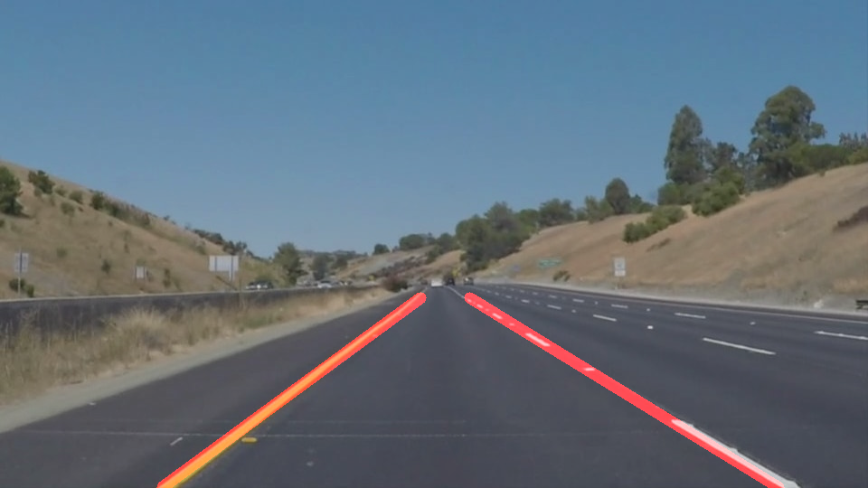

# Finding lane lines on the road
## Udacity Autonomous Vehicles Nanodegree (Project 1)

## Overview

When we drive, we use our eyes to decide where to go.  The lines on the road that show us where the lanes are act as our constant reference for where to steer the vehicle.  Naturally, one of the first things we would like to do in developing a self-driving car is to automatically detect lane lines using an algorithm.

In this project you will detect lane lines in images using Python and OpenCV.  OpenCV means "Open-Source Computer Vision", which is a package that has many useful tools for analyzing images.  

To complete the project, two files will be submitted: a file containing project code and a file containing a brief write up explaining your solution. We have included template files to be used both for the [code](https://github.com/udacity/CarND-LaneLines-P1/blob/master/P1.ipynb) and the [writeup](https://github.com/udacity/CarND-LaneLines-P1/blob/master/writeup_template.md).The code file is called P1.ipynb and the writeup template is writeup_template.md 

To meet specifications in the project, take a look at the requirements in the [project rubric](https://review.udacity.com/#!/rubrics/322/view)

## Pipeline Description

The pipeline consists of 8 steps (not including the code needed to import image files), as follows:

1. Get image size and two-dimensional grid range, and assign values to variables.

2. Grayscale the image — calling helper function `grayscale()` — and apply Gaussian smoothing — calling helper function `gaussian_blur()`.

3. Apply Canny transform — calling helper function `canny()` — to get raw edges in the image. After some trial and error, I decide to use thresholds of `low=35` and `high=70`.

4. Create masked image of edges — calling helper function `region_of_interest()`. I define the vertices as percentages of the range of the image grid. Example: `(0.90*x_max, y_max)`.

5. Apply Hough transform to masked edges. Instead of calling the provided helper function `hough_lines()`, I call `cv2.HoughLinesP()` in order to get array of all Hough lines. I use the following parameters:
	* `rho = 1`
	* `theta = 1*np.pi/180`
	* `threshold = 4`
	* `min_line_len = 25`
	* `max_line_gap = 15`
	
6. Get end-points for each lane line by applying my new helper function, `lane_line()`, which takes Hough line segments and outputs two end-points for a single lane line (right or left). The `lane_line()` function works as follows:
	* Take original image to derive range of axes.
	* Take input side, `'right'` or `'left'`, and filter Hough lines into the requested lane side using the sign of the slope.
	* Take all lines from a single side, and calculate median slope and median intercept (I used the median to avoid too much distortion from outliers).
	* Derive line origin: using the median slope and intercept.
	* Derive line end-points: using origin, median slope, and lane distance.
	* Return line end-points.

7. Draw lane lines on blank image calling modified helper function `draw_lines()`, which I modify as follows:
	* Set default `thickness=12`.
	* Create blank image (i.e., all black) to draw lines on.
	* Take input lines as tuples of two points, as opposed to the output of `cv2.HoughLinesP()`.
	* Draw lane lines on blank image.

8. Add lane lines image to original image calling helper function `weighted_img()`.

Please see output of pipeline on test images below:

| | |
|:------------------------------:|:------------------------------:|
|  solidWhiteCurve.jpg |  solidWhiteRight.jpg |
|  solidYellowCurve.jpg |  solidYellowCurve2.jpg |
|  solidYellowLeft.jpg |  whiteCarLaneSwitch.jpg |
---

## Potential Pipeline Shortcomings

1. The main potential shortcoming of my pipeline is that it is susceptible to unexpected edges that may occur between the lane lines. Edges in the middle of the lane may contribute more Hough lines to the median statistics (used to extrapolate a single lane) than the actual lane-line edges, especially when the line is not solid.

2. The other shortcoming of the pipeline is that it is not optimized for video, which makes the output lane lines a little unstable or shaky on video.

## Possible improvements to your pipeline

1. The most important goal for improvement of the pipeline would be to make it more robust to edges in the middle of the lane. The following ideas come to mind:
	* Implement a more sophisticated separation of Hough lines; one option would be to define, based on their slope, three categories of Hough lines: right line, left line, and noise-edges. This may perform better than my single demarcation into right line and left line.
	* Take into account the relation between the two lines of a lane, in order to rule out unreasonable cases. For example, we may want to write rules about the admissible range of angles at which the extrapolated lane lines may cross (i.e. a 90 degree vertex would be suspicious).

2. In order to address the shortcoming concerning the application of the pipeline to a video stream (shortcoming #2 of the previous section), a possible improvement would be to include some type of smoothing function. The smoothing function would take advantage of the fact that when we are processing video the successive images are not independent from each other. In other words, there is useful information about the position of the lane lines that may be carried over to the processing of the next image in the series. I presume that there is a way to do this so that the output on video is smoother.

## The Project

## If you have already installed the [CarND Term1 Starter Kit](https://github.com/udacity/CarND-Term1-Starter-Kit/blob/master/README.md) you should be good to go!   If not, you should install the starter kit to get started on this project. ##

**Step 1:** Set up the [CarND Term1 Starter Kit](https://classroom.udacity.com/nanodegrees/nd013/parts/fbf77062-5703-404e-b60c-95b78b2f3f9e/modules/83ec35ee-1e02-48a5-bdb7-d244bd47c2dc/lessons/8c82408b-a217-4d09-b81d-1bda4c6380ef/concepts/4f1870e0-3849-43e4-b670-12e6f2d4b7a7) if you haven't already.

**Step 2:** Open the code in a Jupyter Notebook

You will complete the project code in a Jupyter notebook.  If you are unfamiliar with Jupyter Notebooks, check out <A HREF="https://www.packtpub.com/books/content/basics-jupyter-notebook-and-python" target="_blank">Cyrille Rossant's Basics of Jupyter Notebook and Python</A> to get started.

Jupyter is an Ipython notebook where you can run blocks of code and see results interactively.  All the code for this project is contained in a Jupyter notebook. To start Jupyter in your browser, use terminal to navigate to your project directory and then run the following command at the terminal prompt (be sure you've activated your Python 3 carnd-term1 environment as described in the [CarND Term1 Starter Kit](https://github.com/udacity/CarND-Term1-Starter-Kit/blob/master/README.md) installation instructions!):

`> jupyter notebook`

A browser window will appear showing the contents of the current directory.  Click on the file called "P1.ipynb".  Another browser window will appear displaying the notebook.  Follow the instructions in the notebook to complete the project.  

**Step 3:** Complete the project and submit both the Ipython notebook and the project writeup
